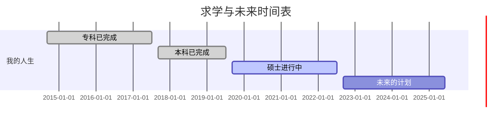
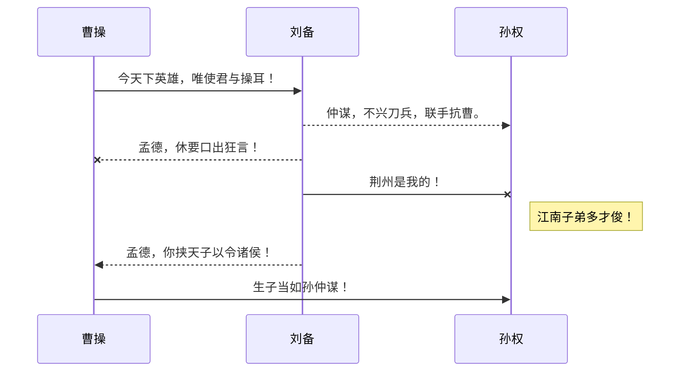
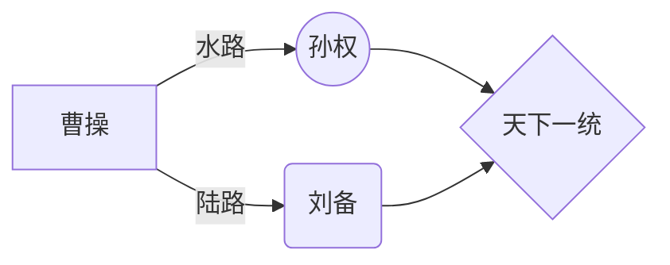

**Markdown语法笔记**

### 一、 多级标题

**Markdown 语法**

```java
# 一级标题（1 个 # 号）
## 二级标题（2 个 # 号）
### 三级标题（3 个 # 号）
#### 四级标题（4 个 # 号）
##### 五级标题（5 个 # 号）
###### 六级标题（6 个 # 号）
```

**生成效果**


---

### 二、文字加粗、斜体、高亮、删除

**Markdown 语法**

```java
**字体加粗**（需要加粗的内容两侧用 ** ，ctrl+b 切换加粗和非加粗）
*斜体* （需要斜体的内容两侧用 *，crtl+i 切换正体和斜体）
**高亮显示** （需要高亮的内容两侧用 **）
~~删除线~~ （需要删除的内容两侧用 ~~ ）
```

**生成效果**

**字体加粗**
*斜体*
**高亮显示**
~~删除线~~

---

### 三、正文换行和换段

这里是Markdown学习笔记（**正文直接输入就可以**） 
希望和大家互相学习，共同进步（上一行尾后 **两个空格然后Enter** 则是换行）

愿祖国繁荣昌盛（上一段尾后 **无空格然后Enter** 则是换段）

---

### 四、有序列表和无序列表

**Markdown 语法**

**无序列表**（即内容前无标号顺序）

```java
- 线性代数（输入顺序：- 空格 线性代数）
- 高等数学（输入顺序：- 空格 高等数学）
- 矩阵论（输入顺序：- 空格 矩阵论）
```

**无序多级列表**（即内容前无标号顺序且有列表层次）

```java
- 线性代数（输入顺序：- 空格 线性代数）
    - 高等数学（输入顺序：按 Tab 键一次 - 空格 高等数学）
        - 矩阵论（输入顺序：按 Tab 键两次 - 空格 矩阵论）
```

**有序列表**（即内容前有标号顺序）

```java
1. 线性代数（输入顺序：1. 空格 线性代数）
2. 高等数学（输入顺序：2. 空格 高等数学）
3. 矩阵论（输入顺序：3. 空格 矩阵论）
```
**有序多级列表**（即即内容前有标号顺序且有列表层次）

```java
1. 线性代数（输入顺序：1. 空格 线性代数）
   1. 高等数学（输入顺序：按 Tab 键一次 1. 空格 高等数学）
        1. 矩阵论（输入顺序：按 Tab 键两次 1. 空格 矩阵论）
```

**生成效果**

**无序列表**

- 线性代数
- 高等数学
- 矩阵论

**无序多级列表**

- 线性代数
  - 高等数学
     - 矩阵论

**有序列表**

1. 线性代数
2. 高等数学
3. 矩阵论

**有序多级列表**

1. 线性代数
   1. 高等数学
      1. 矩阵论

---

### 五、插入图片

****Markdown 语法****

```java
步骤 1：将需要插入的图片与 markdown 文档放到同一文件夹中
步骤 2：输入  则会自动弹出图片名和扩展名，将其输入到 () 中，若没有弹出需手动输入
步骤 3：步骤 2 中的 [] 中可以自定义文件名，如 [棉花糖] ， 默认为空

例如：  
```
****生成效果****


---

### 六、公式和文中公式

**Markdown 语法**

**公式** （公式单独一行）

```java
这是求极限 $$\lim_{x \to \infin} \frac{sin(x)}{x} = 1$$ 的公式

注： $$ 快捷键为两次 ctrl + m
```

**文中公式** （公式嵌入到文字中）

```java
这是求极限 $\lim_{x \to \infin} \frac{sin(x)}{x} = 1$ 的公式

注： $ 快捷键为 ctrl + m
```

****生成效果****

**公式**

这是求极限 $$\lim_{x \to \infin} \frac{sin(x)}{x} = 1$$ 的公式

**文中公式**

这是求极限 $\lim_{x \to \infin} \frac{sin(x)}{x} = 1$  的公式

---

### 七、插入表格

**Markdown 语法**

```java
步骤 1：输入
mesh 1|mesh 2|mesh 3
:---:|:---:|:---:
10x6|20x12|100x60

步骤 2：此步可省。快捷键 alt+shift+f 美观编程界面，效果为
| mesh1 | mesh2 | mesh3  |
| ----- | ----- | ------ |
| 10x6  | 20x12 | 100x60 |

注：:--- 为内容左对齐；:--- 为内容右对齐；:---: 为内容居中对齐；默认为左对齐
```

**生成效果**

| mesh 1 | mesh 2 | mesh 3 |
| :----: | :----: | :----: |
|  10x6  | 20x12  | 100x60 |

---

### 八、插入超链接

**Markdown 语法**

```java
步骤 1：输入 []()
步骤 2：[] 中输入超链接名称，() 中输入超链接地址

或者输入文字后，直接把链接复制到文字上，则代码自动补全 []() 符号

例如：本文参考B站视频超链接
UP主：[zplay](https://www.bilibili.com/video/BV1si4y1472o?from=search&seid=17257293353718123487)
UP主：[是叶十三](https://www.bilibili.com/video/BV1hJ411X75X?from=search&seid=17257293353718123487)
```

**生成效果**

本文参考B站视频超链接
UP主：[zplay](https://www.bilibili.com/video/BV1si4y1472o?from=search&seid=17257293353718123487)
UP主：[是叶十三](https://www.bilibili.com/video/BV1hJ411X75X?from=search&seid=17257293353718123487)

---

### 九、插入代码块

**Markdown 语法**

```java
    ```python
    def function():
        a = 1
        b = 2
        c = a + b
        return c
    ```
注：若为其他语言代码段，则替换 python 为此语言即可
```

****生成效果****

```python
def function():
    a = 1
    b = 2
    c = a + b
    return c
```

---

### 十、分割线

**Markdown 语法**

```java
--- 
或
***
```

****生成效果****

---
---

### 十一、甘特图 （Gantt）

**Markdown 语法**
```java
    ```mermaid
    gantt
        dateFormat  YYYY-MM-DD
        title 读书和娶媳妇时间表
        section 我的人生
        专科已完成               :done,    des1, 2014-09-06, 2017-07-06
        本科已完成               :done,    des2, 2017-09-06, 2019-07-06
        硕士进行中               :active,  des3, 2019-09-06, 2022-07-06
        未来的计划               :         des4, 2022-09-06, 1000d
    ```
```

**生成效果**



---

### 十二、UML 图表

**Markdown 语法**

```java
    ```mermaid
    sequenceDiagram
    曹操 ->> 刘备: 今天下英雄，唯使君与操耳！
    刘备-->>孙权: 仲谋，不兴刀兵，联手抗曹。
    刘备--x 曹操: 孟德，休要口出狂言！
    刘备-x 孙权: 荆州是我的！
    Note right of 孙权: 江南子弟多才俊！

    刘备-->>曹操: 孟德，你挟天子以令诸侯！
    曹操->>孙权: 生子当如孙仲谋！
    ```
```

****生成效果****



---

### 十三、流程图

**Markdown 语法**

```java
    ```mermaid
    graph LR
    A[曹操] -- 水路 --> B((孙权))
    A --陆路--> C(刘备)
    B --> D{天下一统}
    C --> D
    ```
```

**生成效果**



---

### 十四、上标和下标

**Markdown 语法**

```java
上标：2^10^
下标：H~2~O
```

**生成效果**

上标：2^10^
下标：H~2~O

---


### 十五、空格

**Markdown 语法 1**

```java
$~~~$

例：海阔$~~~$天空
```

**生成效果**

海阔$~~~$天空

**Markdown 语法 2**
```java
&nbsp; 插入一个空格
&ensp; 插入两个空格
&emsp; 插入四个空格
&thinsp; 插入细空格

示例：
海阔&nbsp;天空
海阔&ensp;天空
海阔&emsp;天空
海阔&thinsp;天空

注： 分号是语法中的内容
```

**生成效果**
海阔&nbsp;天空
海阔&ensp;天空
海阔&emsp;天空
海阔&thinsp;天空

---

### 十六、选择框和对号

**Markdown 语法**

```java
- [ ] 作者靠才华吃饭
- [x] 作者靠颜值吃饭
```

**生成效果**

- [ ] 作者靠才华吃饭
- [x] 作者靠颜值吃饭
---

### 十七、引用

**Markdown 语法**

```java
>学校：浙江工业大学
>>作者：鸿雁翎
```

**生成效果**

>学校：浙江工业大学
>>作者：鸿雁翎

### 十八、注脚与解释

**Markdown 语法**

```java
参考资料 [^1]
[^1]: 希望和大家一起学习和进步
```

**生成效果**

参考资料 [^1]
[^1]: 希望和大家一起学习和进步

---

- [ ] 学废了 :/
- [X] 学会了 :)

> 作者：韩涛
